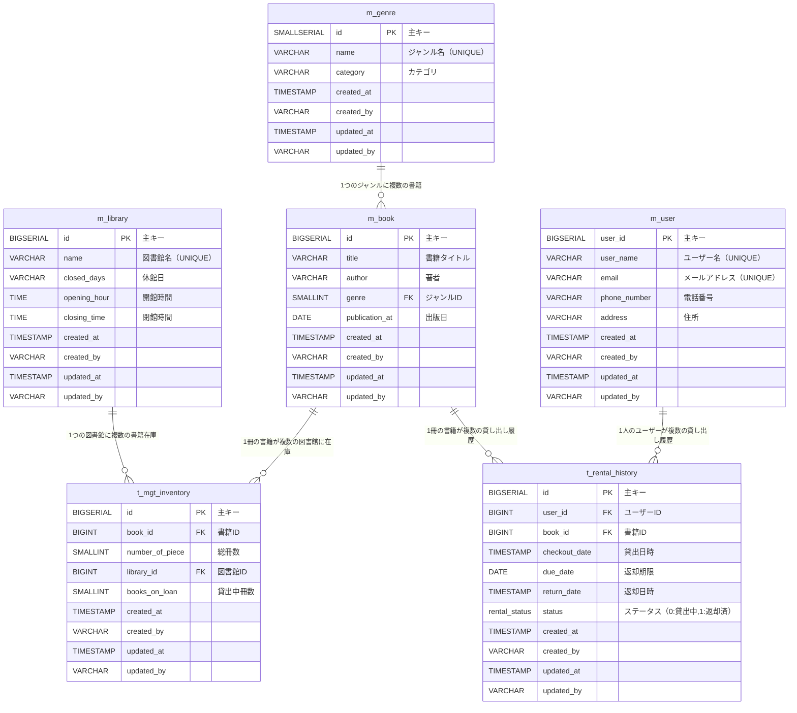

```mermaid
erDiagram
    %% マスタテーブル
    m_genre {
        SMALLSERIAL id PK "主キー"
        VARCHAR name "ジャンル名（UNIQUE）"
        VARCHAR category "カテゴリ"
        TIMESTAMP created_at
        VARCHAR created_by
        TIMESTAMP updated_at
        VARCHAR updated_by
    }

    m_book {
        BIGSERIAL id PK "主キー"
        VARCHAR title "書籍タイトル"
        VARCHAR author "著者"
        SMALLINT genre FK "ジャンルID"
        DATE publication_at "出版日"
        TIMESTAMP created_at
        VARCHAR created_by
        TIMESTAMP updated_at
        VARCHAR updated_by
    }

    m_user {
        BIGSERIAL user_id PK "主キー"
        VARCHAR user_name "ユーザー名（UNIQUE）"
        VARCHAR email "メールアドレス（UNIQUE）"
        VARCHAR phone_number "電話番号"
        VARCHAR address "住所"
        TIMESTAMP created_at
        VARCHAR created_by
        TIMESTAMP updated_at
        VARCHAR updated_by
    }

    m_library {
        BIGSERIAL id PK "主キー"
        VARCHAR name "図書館名（UNIQUE）"
        VARCHAR closed_days "休館日"
        TIME opening_hour "開館時間"
        TIME closing_time "閉館時間"
        TIMESTAMP created_at
        VARCHAR created_by
        TIMESTAMP updated_at
        VARCHAR updated_by
    }

    %% トランザクションテーブル
    t_mgt_inventory {
        BIGSERIAL id PK "主キー"
        BIGINT book_id FK "書籍ID"
        SMALLINT number_of_piece "総冊数"
        BIGINT library_id FK "図書館ID"
        SMALLINT books_on_loan "貸出中冊数"
        TIMESTAMP created_at
        VARCHAR created_by
        TIMESTAMP updated_at
        VARCHAR updated_by
    }

    t_rental_history {
        BIGSERIAL id PK "主キー"
        BIGINT user_id FK "ユーザーID"
        BIGINT book_id FK "書籍ID"
        TIMESTAMP checkout_date "貸出日時"
        DATE due_date "返却期限"
        TIMESTAMP return_date "返却日時"
        rental_status status "ステータス（0:貸出中,1:返却済）"
        TIMESTAMP created_at
        VARCHAR created_by
        TIMESTAMP updated_at
        VARCHAR updated_by
    }

    %% リレーションシップ
    m_genre ||--o{ m_book : "1つのジャンルに複数の書籍"
    m_book ||--o{ t_mgt_inventory : "1冊の書籍が複数の図書館に在庫"
    m_library ||--o{ t_mgt_inventory : "1つの図書館に複数の書籍在庫"
    m_user ||--o{ t_rental_history : "1人のユーザーが複数の貸し出し履歴"
    m_book ||--o{ t_rental_history : "1冊の書籍が複数の貸し出し履歴"
```