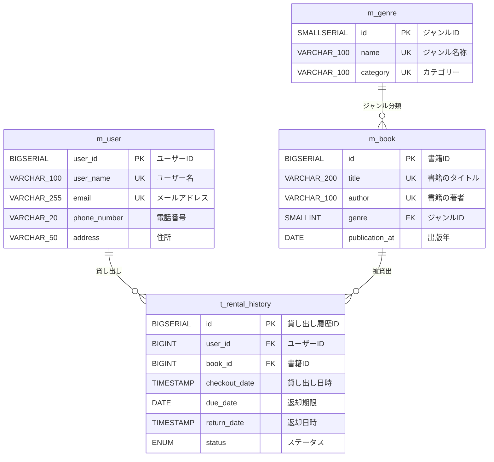

```mermaid
erDiagram
    m_book {
        BIGSERIAL id PK "書籍ID"
        VARCHAR_200 title UK "書籍のタイトル"
        VARCHAR_100 author UK "書籍の著者"
        SMALLINT genre FK "ジャンルID"
        DATE publication_at "出版年"
    }
    
    m_genre {
        SMALLSERIAL id PK "ジャンルID"
        VARCHAR_100 name UK "ジャンル名称"
        VARCHAR_100 category UK "カテゴリー"
    }
    
    m_user {
        BIGSERIAL user_id PK "ユーザーID"
        VARCHAR_100 user_name UK "ユーザー名"
        VARCHAR_255 email UK "メールアドレス"
        VARCHAR_20 phone_number "電話番号"
        VARCHAR_50 address "住所"
    }
    
    t_rental_history {
        BIGSERIAL id PK "貸し出し履歴ID"
        BIGINT user_id FK "ユーザーID"
        BIGINT book_id FK "書籍ID"
        TIMESTAMP checkout_date "貸し出し日時"
        DATE due_date "返却期限"
        TIMESTAMP return_date "返却日時"
        ENUM status "ステータス"
    }

    %% リレーションシップ
    m_genre ||--o{ m_book : "ジャンル分類"
    m_user ||--o{ t_rental_history : "貸し出し"
    m_book ||--o{ t_rental_history : "被貸出"
```