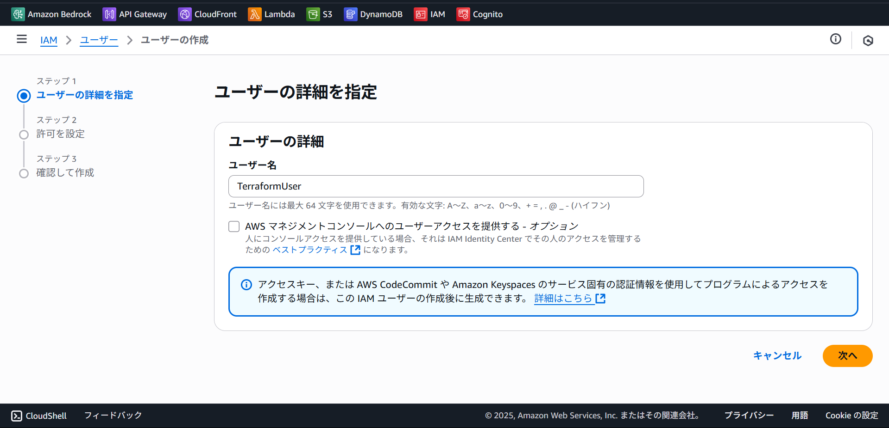
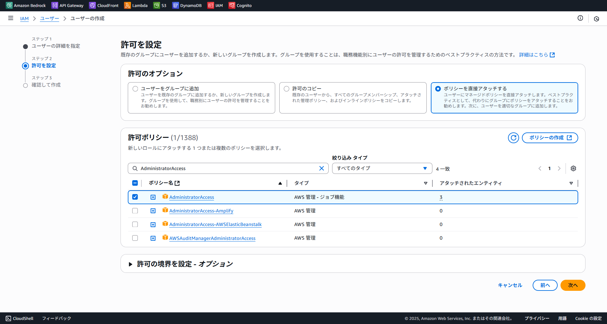
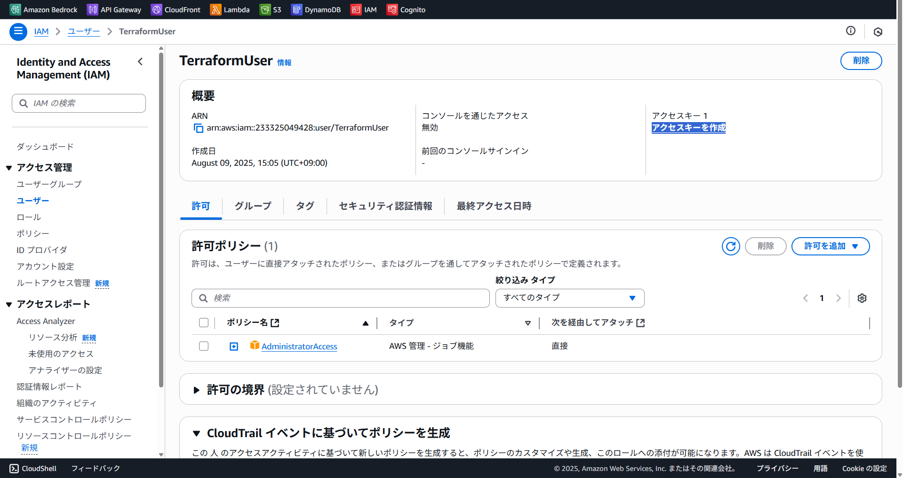
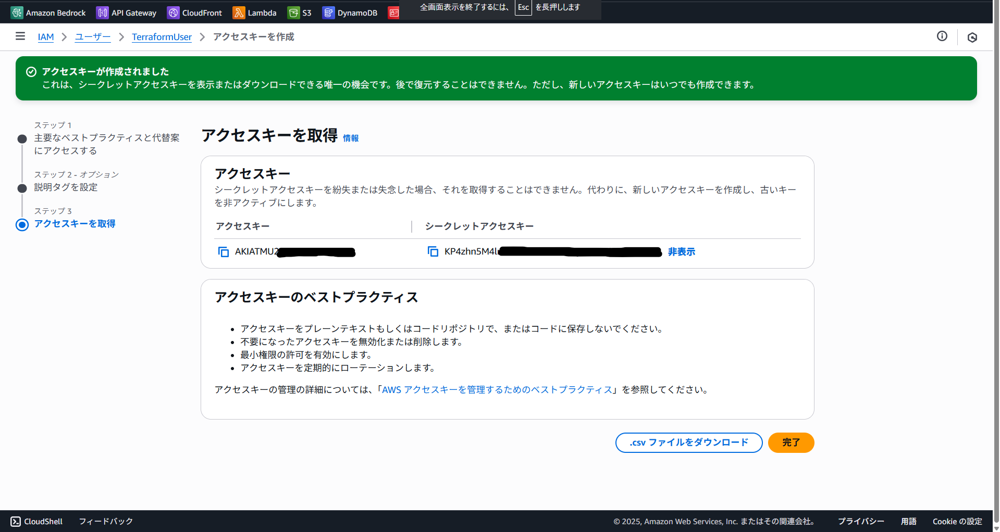

## TerraformでIaC化

```text
2025/08/09

初めてのIaCということで、簡単に作成したWebページをS3にアップロード、CloudFrontでHttps配信という
シンプルな構成をまずはAWSマネジメントコンソールで手動作成し、その後それをIaC化してみた
```

#### 前提条件

- AWSのアカウントが作成済み
- Terraformがローカル環境にインストール済み

### AWS CLIの準備を行う

コードでのインフラ管理はGitbashなどのコンソールからコマンドでAWSクラウド環境にアクセスし、構築を行っていきます

今回扱うTerraformでは、AWSにリソースを作成する際にAWS CLIの認証情報を使ってアクセスしています

そのためまずはAWS CLIの準備が必要です

#### 1. AWS CLIのインストール

[AWS CLIのインストール](https://docs.aws.amazon.com/cli/latest/userguide/getting-started-install.html) を実施してください

#### 2. IAMユーザーを作成する

AWSマネジメントコンソールにアクセスし、検索窓からIAMサービスにアクセス

左ペインから”ユーザー”をクリックし、ユーザー作成に進む

ユーザー名はわかりやすい任意の名前で問題ない（今回はTerraformUserとした）



次へ進むとIAMユーザーの許可ポリシーを設定する画面に遷移するので、

許可オプションの中から「ポリシーを直接アタッチする」を選択

許可ポリシーの中から「AdministratorAccess」を選ぶ



#### 3. アクセスキーを発行する

作成したユーザーの概要からアクセスキー発行を開始する



主要なベストプラクティスと代替案を提示してくる画面があるが、今回は提案を受け入れず次に進む

説明タグは必要に応じて適宜設定し、最後まで対応するとアクセスキーを取得できる

**アクセスキーは一度表示を消すと再表示できないので注意**



取得したアクセスキーとシークレットキーはのちにAWS CLIの設定の際に必要のため一時的にメモ帳などに控えるなどする

#### 4. AWS CLIの認証

GitBashなどのコンソールを開き、`aws configure`とコマンドを実行

対話形式で設定をしていくので、作成したインフラ環境に合わせて設定していく

- AWS Access Key ID:（先ほど発行したアクセスキー）
- AWS Secret Access Key:（先ほど発行したシークレット）
- Default region name: ap-northeast-1
- Default output format: json（または空でもOK）

### Terraformのコードを書いていく

設定が完了したので、AWSに構築するインフラ構成をコードに起こしていく

作成するファイルやディレクトリ構成などは別ドキュメントにまとめた

[Terrafromディレクトリ構成とファイルについて](./terraform-env-setting.md)

### 作成したコードでAWSサービスを作成する

作成したTerraformの設定ファイルを実行しAWS上に各種サービスを作成する

#### 1. Terraform作業ディレクトリの初期化

```bash
terraform init
```

プロバイダプラグインのダウンロードやバックエンドの初期化などを行っている

またこのタイミングでモジュールのダウンロードを行い、.terraform/modulesに展開している

#### 2. インフラ環境のプリ実行

```bash
terraform plan
```

実際のインフラ環境に変更を行わず、記述したTerraform設定ファイルを実行した場合の変更内容をプレビュー確認できる

#### 3. インフラ環境を実際に構築

```bash
terraform apply
```

Terraform設定ファイルに記述された内容をもとに実際にクラウド環境に適応させるコマンド

1. main.tfやvariables.tfファイルなどを読み込み
2. 作成済みのterraform.tfstateや実際のクラウド環境を確認
3. 差分を計算、算出する
4. 差分をクラウド環境に適応させる
5. 変更後の状態をterraform.tfstateファイルに記録する

`terraform apply`が成功したらインフラ環境が構築されているので、AWSマネジメントコンソールにログインして確認する